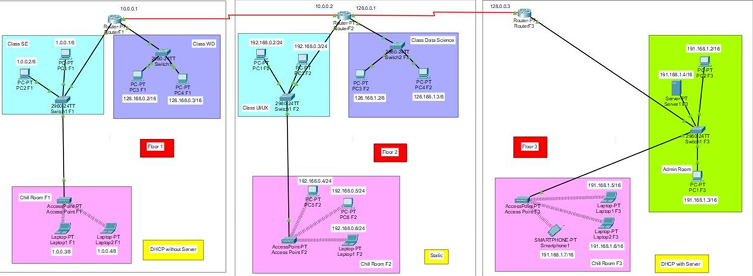
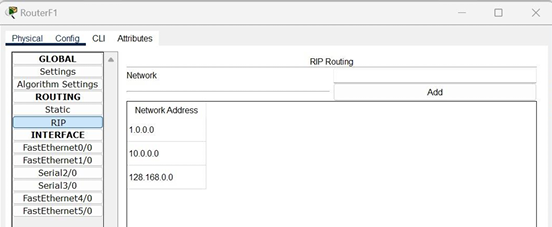

# Digicamp Network Simulation

## Project Overview
This project involved simulating a network infrastructure for Digicamp, a digital skills training provider. The goal was to implement and configure a network system across three building floors, integrating routers, switches, PCs, access points, and a server, while applying network services such as DHCP, static IP assignment, and a web server.

## Project Steps

### 1. Network Topology Design
- Created a three-floor network topology.
- Deployed core devices: routers, switches, access points, PCs, laptops, and a server.
- Assigned network addressing schemes using both DHCP and static IPs based on different sections.

### Router Setup

> **Figure 2:** Configuration of routers with RIP routing protocol and interface IP setup.

### Server Setup

> **Figure 3:** Server configuration providing DHCP and DNS services to the network.

### Testing and Verification

> **Figure 4:** Successful ping tests between different floors, validating full connectivity.

## Tools and Environment
- **Hardware:** ASUS Vivobook
- **Operating System:** Windows 11 64-bit
- **Software:** Cisco Packet Tracer, Microsoft Word, Google Drive

## Key Outcomes
- Full network simulation for a multi-floor building.
- Implementation of DHCP and static IP addressing.
- Successful integration of web and DNS servers.
- Reliable connectivity across all floors and departments.

---

> _"Building efficient networks, one simulation at a time."_

---
