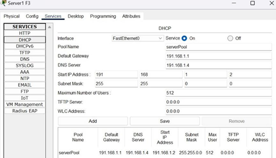
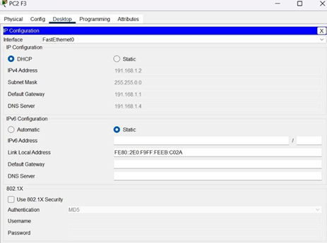
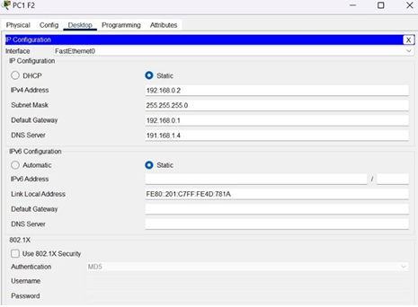
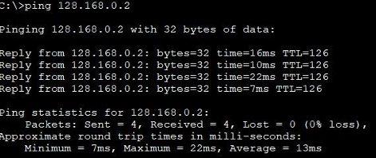
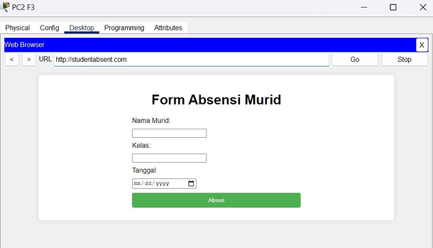

# Digicamp Network Simulation

## Project Overview
This project involved simulating a network infrastructure for Digicamp, a digital skills training provider. The goal was to implement and configure a network system across three building floors, integrating routers, switches, PCs, access points, and a server, while applying network services such as DHCP, static IP assignment, and a web server.

[View Full Project Report (PDF)](Cisco-PT-Project.pdf)

## Project Steps

### 1. Network Topology Design
- Created a three-floor network topology.
- Deployed core devices: routers, switches, access points, PCs, laptops, and a server.
- Assigned network addressing schemes using both DHCP and static IPs based on different sections.

### 2. Router Setup
Set up router interfaces with IP addresses and configured the RIP routing protocol to enable communication across different floors.

> **Figure 2:** Configuration of routers with RIP routing protocol and interface IP setup.

### 3. Server Setup
Configured a server to handle DHCP IP distribution, DNS name resolution, and web hosting services for the network.

> **Figure 3:** Server configuration providing DHCP services to the network.

### 4. IP Setup
Configured devices with a mix of static and dynamic IP addresses to optimize network management. Core infrastructure components (such as servers and key routers) were assigned static IPs for reliability, while user devices (PCs, laptops, smartphones) received IPs dynamically via DHCP.

> **Figure 4:** Server configuration providing DHCP services to the network.

> **Figure 5:** Server configuration providing DNS services to the network.

### 5. Testing and Verification
Performed connectivity tests using the ping tool between devices on different floors and departments to ensure the routing, DHCP, and DNS services were correctly implemented.

> **Figure 6:** Successful ping tests between different floors, validating full connectivity.

> **Figure 7:** Successful ping tests between different floors, validating full connectivity.

> **Figure 7:** Successful web service access, validating full connectivity.

## Tools and Environment
- **Hardware:** ASUS Vivobook
- **Operating System:** Windows 11 64-bit
- **Software:** Cisco Packet Tracer, Microsoft Word, Google Drive

## Key Outcomes
- Full network simulation for a multi-floor building.
- Implementation of DHCP and static IP addressing.
- Successful integration of web and DNS servers.
- Reliable connectivity across all floors and departments.

---

> _"Building efficient networks, one simulation at a time."_

---
